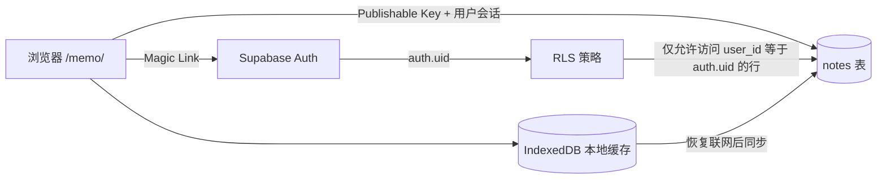

# 跨浏览器备忘录 Supabase 配置说明

## 一、架构与安全边界

备忘录页面继续由 GitHub Pages 托管，Supabase 提供用户认证和 PostgreSQL 数据存储。



`supabaseUrl` 和 `supabasePublishableKey` 会随静态网站公开。数据安全依赖数据库的 Row Level Security 策略，不依赖前端隐藏配置。

禁止将以下内容写入仓库或浏览器代码：

- Supabase `service_role` key；
- 数据库密码；
- Supabase Personal Access Token；
- 任何能够绕过 RLS 的服务端凭证。

## 二、创建 Supabase 项目

1. 登录 Supabase Dashboard。
2. 在个人组织下创建项目。
3. 选择合适的区域并保存数据库密码；数据库密码仅用于管理，不写入本仓库。
4. 项目创建完成后，进入 SQL Editor。

## 三、创建数据表和 RLS 策略

在 SQL Editor 中执行以下迁移文件的完整内容：

```text
supabase/migrations/202608100001_create_notes.sql
```

迁移会完成以下操作：

- 创建 `public.notes` 表；
- 建立用户和更新时间索引；
- 自动维护 `updated_at`；
- 开启 RLS；
- 分别创建查询、新增、修改和删除策略；
- 拒绝未登录的 `anon` 角色访问；
- 允许 `authenticated` 角色操作自己的备忘录。

迁移执行后，应在 Table Editor 中确认 `notes` 表的 RLS 状态为启用。

## 四、配置登录回调地址

进入 `Authentication -> URL Configuration`，配置以下地址：

```text
Site URL:
https://dezhonger.github.io/memo/

Redirect URLs:
https://dezhonger.github.io/memo/
http://localhost:4000/memo/
```

生产地址使用精确路径，不使用宽泛通配符。

## 五、配置登录邮件

当前页面支持邮箱密码登录，也保留 Supabase 默认 `Magic link or OTP` 登录。邮箱密码登录不依赖邮件发送额度；Magic Link 仍使用 Supabase 默认邮件服务。

Supabase 内置邮件服务只适合测试，当前项目的邮件发送额度为每小时 2 封，并且只会向项目团队成员的邮箱发送邮件。若要让其他邮箱稳定使用 Magic Link，必须配置自定义 SMTP。

跨浏览器登录时，可以在每个浏览器直接输入同一邮箱和密码。也可以在发起请求的浏览器中打开对应登录邮件。每个浏览器会分别建立 Supabase Auth 会话，并通过同一用户和 RLS 策略读取相同数据。

如果以后配置自定义 SMTP，可以在模板中增加 `{{ .Token }}`，并在前端恢复手工 OTP 输入功能；这不是当前部署的必要条件。

## 六、创建唯一允许登录的用户

当前前端调用 `signInWithOtp` 时设置了 `shouldCreateUser: false`，因此公开页面不能自动注册新用户。

应执行以下步骤：

1. 进入 `Authentication -> Users`。
2. 使用 `Add user` 预先创建自己的邮箱账号，并确认邮箱状态有效。
3. 在 Auth 配置中保持公开注册关闭。
4. 使用该邮箱在 `/memo/` 页面请求登录邮件。

如果以后需要增加用户，应继续由 Dashboard 管理员显式创建。RLS 会隔离不同用户的数据。

## 七、填写前端公开配置

进入 `Project Settings -> API`，复制以下两项：

- Project URL；
- Publishable key。旧项目如果尚未提供 publishable key，可以使用 `anon` key，但仍然不能使用 `service_role` key。

填写文件：

```text
source/assets/memo/memo-config.js
```

格式如下：

```javascript
window.DEZHONGER_MEMO_CONFIG = Object.freeze({
  supabaseUrl: 'https://PROJECT_REF.supabase.co',
  supabasePublishableKey: 'sb_publishable_...',
})
```

## 八、本地验证

安装依赖并构建：

```bash
npm install
npm run test:memo
npm run build
```

启动本地站点：

```bash
npm run server
```

访问：

```text
http://localhost:4000/memo/
```

## 九、验收清单

- 未登录用户无法查询 `notes` 表。
- 未预先创建的邮箱无法注册或登录。
- 登录后可以创建、修改、删除和搜索备忘录。
- 同一账号在两个浏览器登录后可以读取相同数据。
- 断网编辑时页面显示待同步数量，恢复联网后自动完成同步。
- Markdown 预览不会执行正文中的脚本。
- JSON 导出和导入能够完整保留标题、正文、标签和时间字段。
- 退出登录前会完成同步；退出后会清除该浏览器中的备忘录缓存。
